# Handwriter

Make writing easier!


## End of life

This was a fun project, but I don't have the time to work on it anymore. Whatever has been implemented will remain, but I won't be adding new features, at least for now. Maybe I'll add some more cool features in the future.

However, if you want to contribute, specially to complete the [TODO](#TODO)s below, feel free to fork the project and send me pull requests.

## How to

1. Download and install a [handwriting font](https://fonts.google.com/?category=Handwriting), or [create a font](#Creating-your-font) from your handwriting.
2. Use a word processor like *Microsoft Word* or *LibreOffice Writer* to write to your heart's content with the handwriting font. (Hint: Use colors. `#000000` for black, and `#082A5E` for blue works nicely.)
3. [Introduce some mistakes.](#Introducing-mistakes)
4. Save each page as an image.

   * Save directly as an image. I use a size of (1626*2300) and a resolution of 50 pixels/cm (*LibreOffice Writer*).
   * Save as a PDF and convert to PNGs.
     ```bash
     pdftoppm -png pdf_file.pdf image_name -scale-to-x 1626 -scale-to-y 2300
     ```
5. Transform the images to handwriting style. Requires *numpy* and *OpenCV*.
   ```bash
   python3 writing_artifact.py /path/to/image_name-*.png
   ```

   The images are saved (by default) in the `./out/` folder.
6. Change the edited images back to PDF.
   ```bash
   convert image_name-*_edited.png pdf_edited.pdf
   ```

## Simulating handwritten text

This is yet another project to create handwritten-style documents digitally. You may use this for **assignments**, among other things. Other similar projects/links include (in no particular order):

* [MyHandWriting](https://github.com/bannyvishwas2020/MyhandWriting)
* [Text to Handwriting](https://saurabhdaware.github.io/text-to-handwriting/)
* [Recurrent Neural Network Handwriting Generation Demo](https://www.cs.toronto.edu/~graves/handwriting.html)
* [calligrapher.ai](https://www.calligrapher.ai/)
* [Handwriting Synthesis](https://github.com/sjvasquez/handwriting-synthesis)
* [handLaTeX](https://github.com/DavideFauri/handlatex)
* [Scriptalizer](https://www.scriptalizer.co.uk/scriptalizer.aspx)

I prefer typing, like other like-minded individuals who might be interested in this project, or who know or uses the above links. And typing saves paper, saves trees, saves the planet; now I'm just being ambitious. What more, if you want to copy your answers from some source, not that I support cheating, typing is much easier (copy-paste).

### Why another project?

This project was inspired by [MyHandWriting](https://github.com/bannyvishwas2020/MyhandWriting), or rather, the developer's [Reddit post](https://www.reddit.com/r/Python/comments/g5bbss/my_professor_wants_hand_written_assignments_so_i/). However, that, or other projects above support only plain text, without any formatting. For instance, what if you want a table or just multiple columns?

This project achieves this in two steps. First, the properly formatted text is written with a word processor, and each page is saved as an image. Then, the images are transformed in handwritten style with
```bash
python3 writing_artifact.py /path/to/pages.png
```

The code above simulates different handwriting artifacts and places the text on a white (A4, preferably) page. Several ideas were taken from the shortcomings of the above projects. This of course assumes that you don't have beautiful calligraphic handwriting.

## Steps taken

The code uses *numpy* and *OpenCV* to do its job. Make sure to install them with `pip`. The following images were edited with GIMP, but the same thing is done with *OpenCV* in the code. The following images use the [Homemade Apple](https://fonts.google.com/specimen/Homemade+Apple) font, but I use my handwriting as a font. Using your handwriting gives better results. This code also makes several assumptions based on my writing style.

### Creating your font

If you want to use your handwriting as a font, use a site like [Calligraphr](https://www.calligraphr.com/en/). You may create a randomized font, but that is not necessary; the code will [randomize the text](#Randomizing-text). Once you've downloaded the font, use software like [FontForge](https://fontforge.org/en-US/) to edit the kerning or left and right bearing. I prefer editing the kerning. If your handwriting is cursive and continuous, this step is necessary.

To edit kerning for a font

1. Open the font with FontForge.
2. Go to *Metrics > New Metrics Window*.
3. Go to *Metrics > Window Type*, make sure that *Kerning only* is selected.
4. Click on the *New Lookup Subtable...* dropdown, click *New Lookup Subtable...*
   1. Under the *Feature* column in the popup, click on the dropdown beside *&lt;New&gt;*. Select *kern Horizontal Kerning*.
   2. Click *OK*.
   3. Again click *OK* in the popup, rename the table if you want.
5. Type some common words. Drag the characters or edit the values in the *Kern* field.
   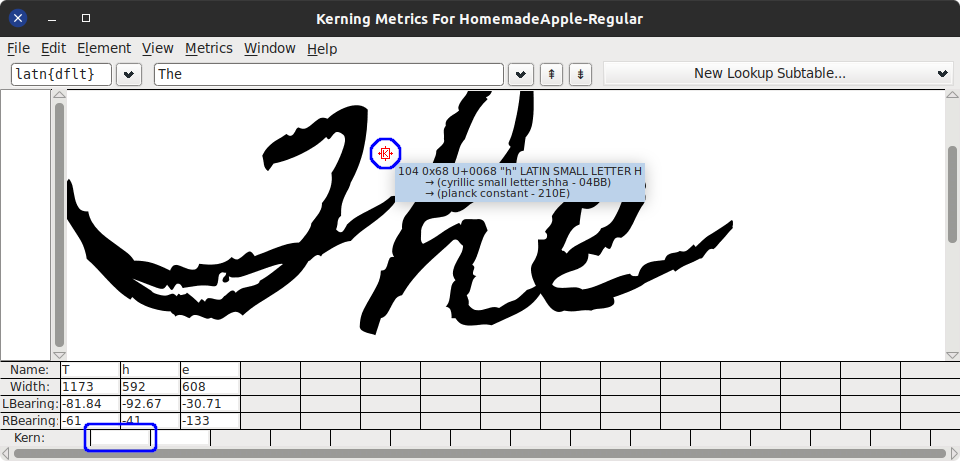
   Type other words and adjust kerning. You don't need to do this for all letter pairs; when using the font, if you find some discrepancies, edit the kerning accordingly.
6. Close the window.
7. Go to *File > Generate Fonts...* Navigate to the folder where to save, choose the file name and *Generate*. You may ignore any warnings.

You may want to add other glyphs and tables to the font for ligatures, conditional substitution, etc. For instance, cursive uppercase letters not followed by a lowercase letter might look odd. In such cases, an alternate glyph might be suitable. As for me, I use a different font for these letters (see in [Introducing mistakes](#Introducing-mistakes)).

Install the font. Clicking on the saved font will install it on most platforms. Re-edit the font file and (uninstall) reinstall when required.

### Write

Use your favorite word processor to write whatever you want. Don't forget to use the font you just installed. Edit margins (usually reduce) to match your writing style. Make sure to use a white background and dark colors for writing. Do not use the red color as it is used to [mark mistakes](#Introducing-mistakes). The code makes these assumptions. If you're using tables, remove the borders. Change line spacing to 1.5 (recommended).

### Introducing mistakes

Humans make spelling mistakes when writing, and strike out the mistakes. This is done by surrounding a misspelled word with a red border. The following steps add a red border in LibreOffice Writer.

1. Select a misspelled word.
2. *Right click > Character > Character...*
3. Go to *Borders*.
4. Select the second option in *Presets:* to add a border on all sides.
5. In *Padding*, set everything to 0 (optional).
6. Under *Line* in *Color:*, set to red (`#FF0000`).

There's also a LibreOffice [macro](macro.py) available to perform these steps. The macro is limited, edit the code for variations.

1. Copy paste the macro in `~/.config/libreoffice/4/user/Scripts/python/`. Rename if you want.
2. Restart LibreOffice if needed.
3. Select all text where mistakes need to be inserted.
4. Go to *Tools > Macros > Organize Macros > Python...*
5. Expand *My Macros > name_of_macro_that_you_copied*, select `introduceMistakes` and click *Run*.
6. This will randomly add misspelled words with a red border. This will also change the font for those uppercase letters which are not followed by a lowercase letter.

There are some known bugs/features.

* It does not introduce mistakes in text inside objects, for instance, tables. For this, select the text inside each object (each table cell) and re-run the macro.
* Sometimes (when there's an object at the end of a selection), you might see the `INTRODUCEMISTAKEENDMARKER` word. Delete it.

[Make a menu entry](https://ask.libreoffice.org/en/question/156744/assign-macro-to-toolbar/) for easier access to the macro.

### Introduce artifacts

Save the document as a PDF or images. If PDF, convert the pages to images with your preferred method. Now pass the folder with all the images as an argument to the code. You may also pass each image individually, and/or use wildcards. Note that, for wildcards, the code relies on the shell to expand the file names.

The output images are saved as `<img_name>_edited.<extension>`. By default, the image's original extension (format) is used. You can change the format with the `-f` or `--output-format` option. Since OpenCV is used to read and write image files, the extension must be one supported by your installation of OpenCV. By default, the output images are saved in the `./out/` directory. You can change this with the `-o` or `--out` option.

Use `python3 writing_artifact.py -h` for help. Relevant options will be discussed below.

### Getting the mask

As discussed earlier, the mistakes in the document are marked with a red border. The first step is to get these red rectangles as a mask, and the image without the red color.
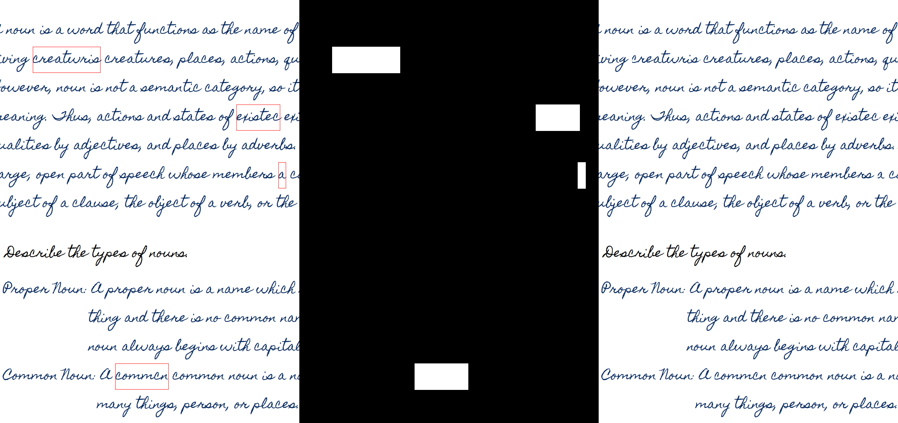
You may notice slight artifacts where the red lines were present, a little bit of the text is missing. This is because this font uses negative bearings to simulate the cursive overlap. This can be prevented slightly if kerning is used instead.

#### Preprocessing

The original text is slightly thin, but that's how my handwriting font is. So there's an extra preprocessing step, which thickens the letters slightly and reduces sharp edges.

### Randomizing text

As of now, all the letters look the same. However, in handwriting, there's some variation in every letter. One way is to use a randomized font. Alternately, we can randomly move the text a little with a noise map.
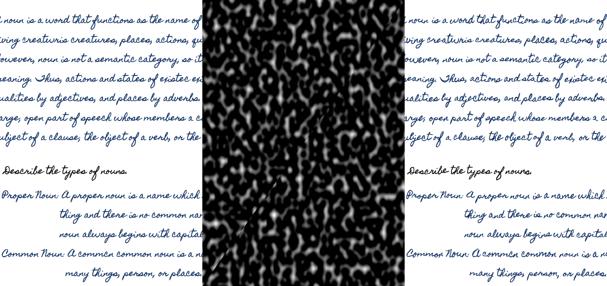
There's two noise map here, one for each axis. The amount to move the text with these maps can be controlled with the `-r` option; `0` means no movement, other values move in the positive or negative direction. The scale of the noise map can be controlled with the `-s` option; higher values mean a higher frequency of the noise. Experiment with this to match your font size.

### Striking the mistakes

Using the mask, some strikes are generated randomly and applied on top of the mistakes. The color of the strikes is automatically extracted from the surrounding texts.
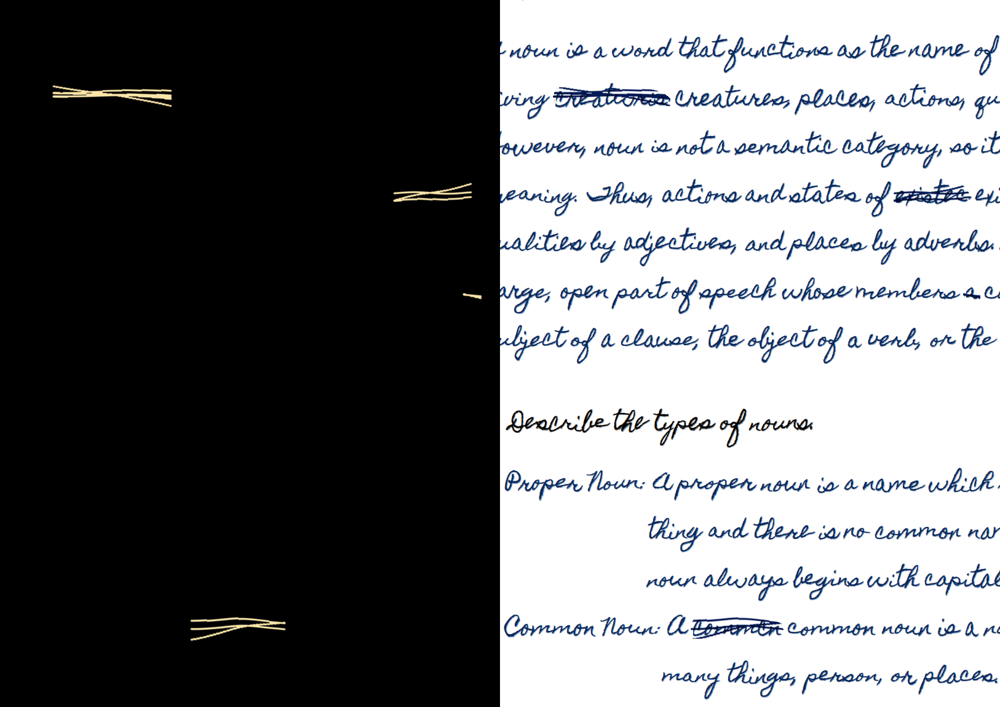
The original strikes are generated with inverted colors for easier processing. The strikes are also cropped with a convex hull of the text.

### Getting lines of text

We go through each row of pixels in the image and check if it only consists of white rows or other colors too. This is used to divide the image into alternating white and text areas. We also select some of the lines based on their length, line spacing, etc.
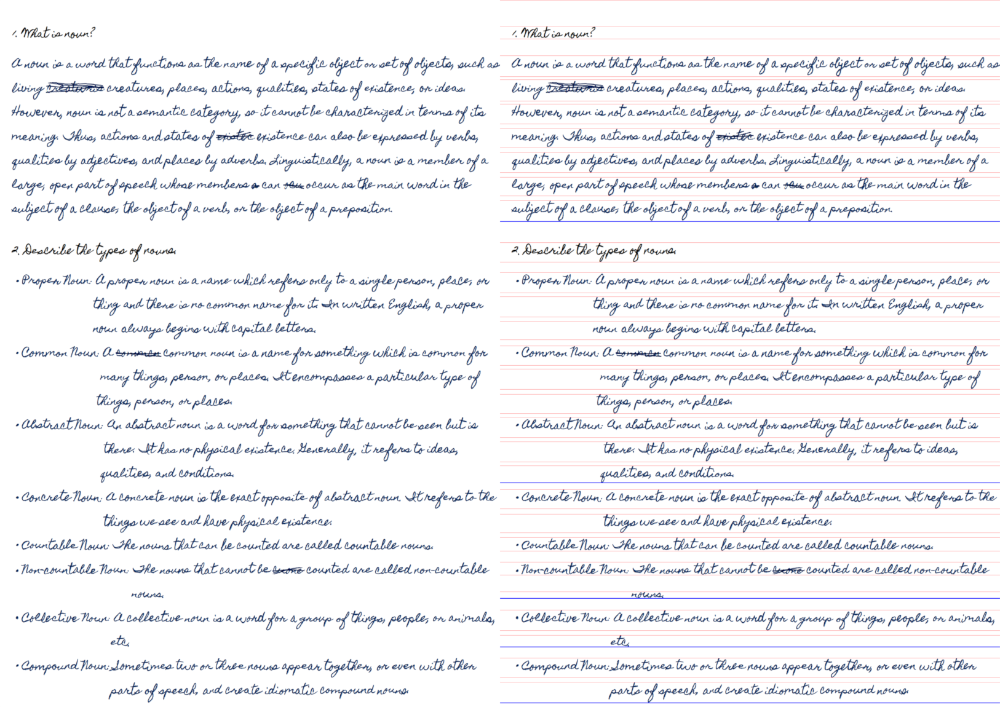
The red lines show the rows, the blue lines are the selected ones. Sometimes, if two lines are too close, they might be detected as a single line. Try changing the line height if so.

### Change line spacing

In handwriting, we tend to have some lines closer to each other than others. In other words, we have varying line spacing. Using the rows of text found above, we move each line randomly up or down. We also move each line randomly left or right a little so that every line doesn't start from the same position (column).
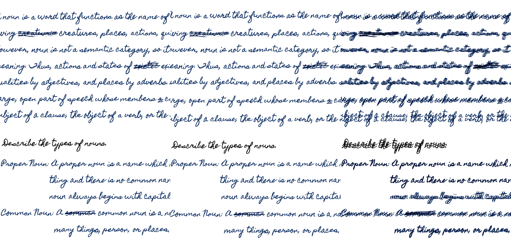
The amount to move the lines up or down in this step can be controlled with the `-t` option; `0` means no movement, other values move in the positive or negative direction.

### Slanting lines

When writing, we tend to slant the lines (generally upwards). We select blocks of text based on the selected lines above (blue lines) and slant each of these blocks separately. Several different methods to slant the text is available and one of them is chosen randomly. For each of the blocks, either no slanting is done, or

1. Skew all the lines together.
   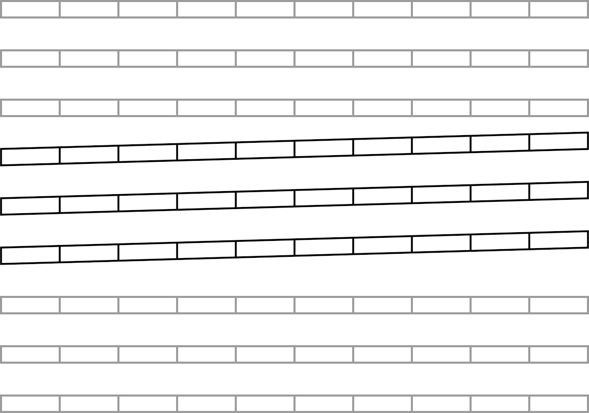
2. Skew each line by a different amount. The first line is not skewed, the second line is skewed a little, the third line is skewed a little more, and so on.
   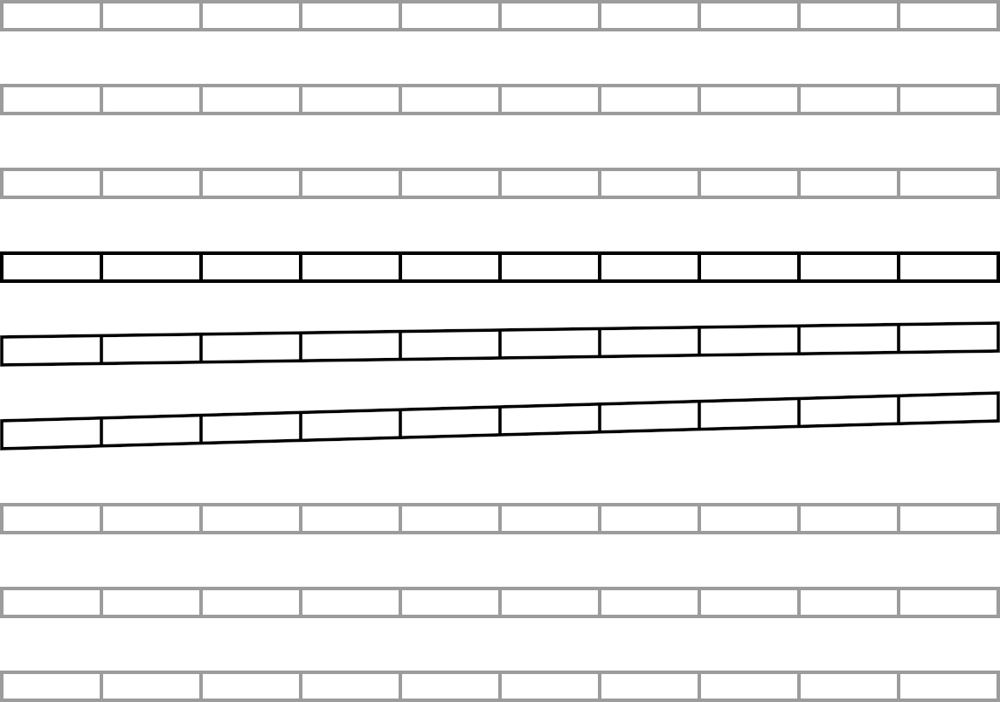
3. Fake perspective transforms to shorten the right side of the text.
   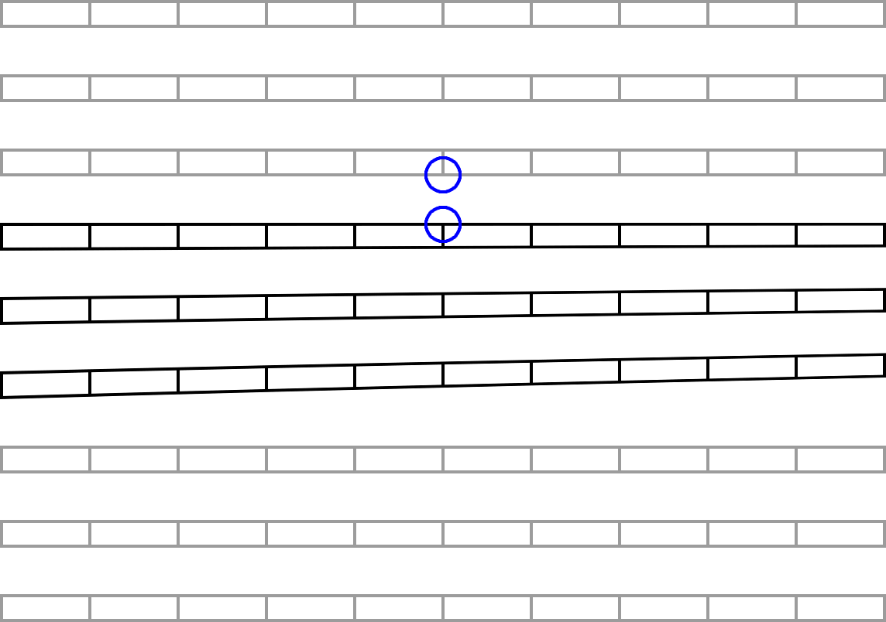

#### What's a fake perspective?

With a normal perspective transform, we get the following.
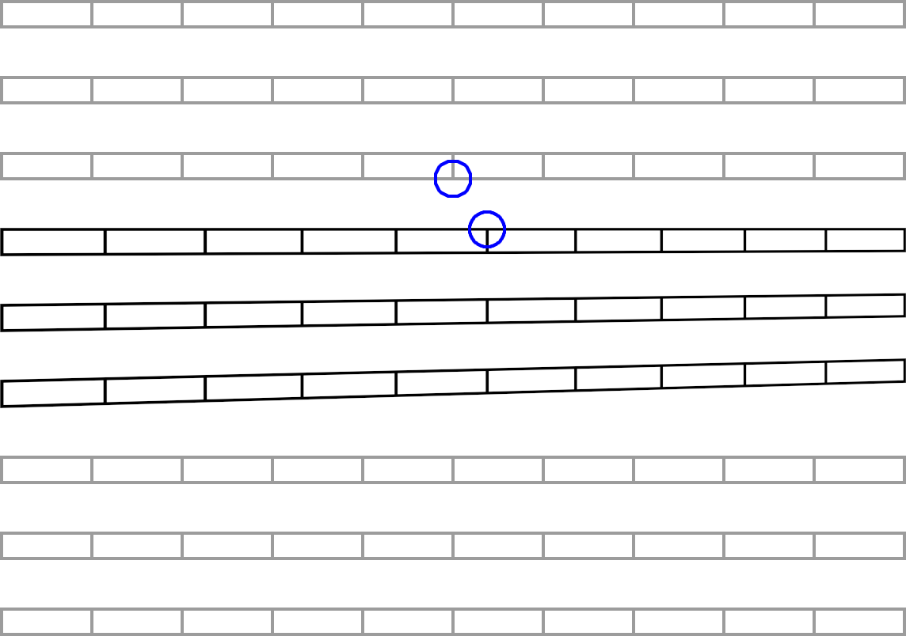
Note how the columns on the top move to the right. This is not an error, but the expected behavior of perspective transform. However, we can't have this in our case since this will mess up column alignments, for instance, in tables.

Instead, we use a vertical displacement map like the following to shrink the right side of the block.
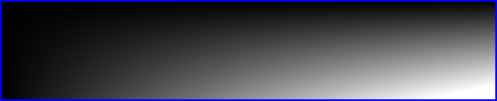
This generates the slants as shown above with proper column alignment. The amount to slant the lines in this step can be controlled with the `-k` option; `0` means no movement, other values move in the positive (upward) or negative (downward) direction.

### Fading text

When we write on a page, the text doesn't have the same opacity everywhere. Due to how the ink is soaked and dries, some text might appear lighter than the rest. Using a noise map, the text is faded randomly.
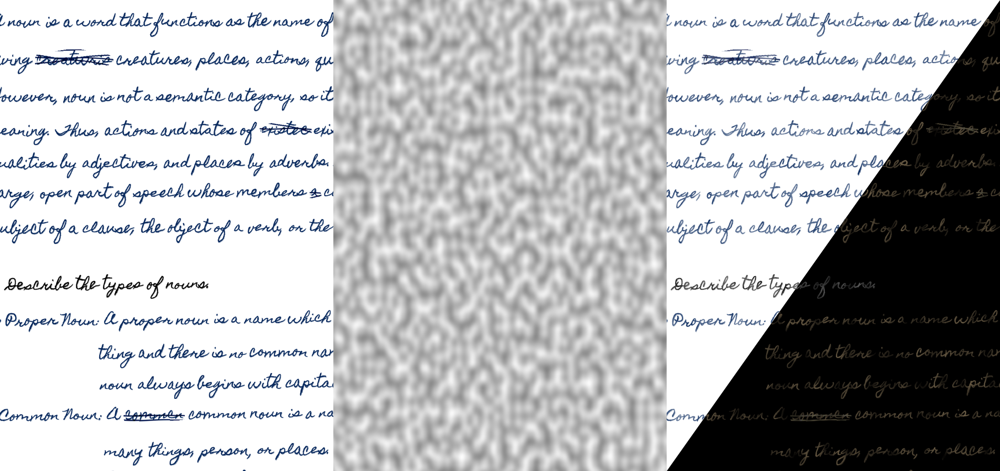
This makes parts of the text lighter depending on the lightness of the noise map. The lowest opacity of faded text can be controlled with the `-a` option; `0` means part of the text is not visible at all, `1` means no fading (fully opaque).

### Backgrounds

Once we've sufficiently applied handwriting effects to the text, we need to place it on top of an (A4) paper texture. By default, the background images are read from the `./background` folder. You can change this with the `-b` or `--background` option.

To use your backgrounds, scan or take a picture of a white A4 paper. Use image editing software like GIMP to crop the image such that the page fills the whole image. You might also need to apply some perspective transformation and/or cage transformations to fit the image. Without this, the curves in the paper will make the output look unnatural. Place the edited images in your background folder.

### Reading backgrounds

When a background image is read, some optional transformations are randomly applied to generate variations of the background.
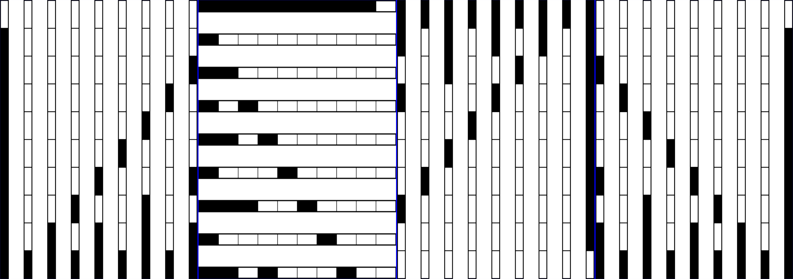
The original image and three other variations can be combined to produce 8 different backgrounds from a single background. Moreover, multiple backgrounds can be merged to generate even more backgrounds. Each of those backgrounds can have its variations. This allows generating a wide number of backgrounds from only a few original ones.

When multiple images are passed to the code at once, one background for each of them is generated at a time while ensuring that each of them is unique.

### Merging text on background

Once the background is read, it might have shadows. These shadows are used to further displace the image to give the effect that the text curves with the page.
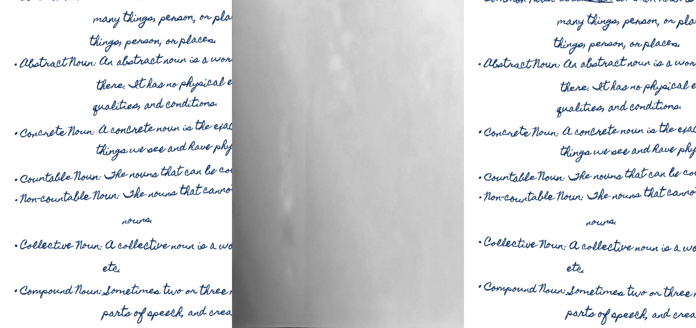
Finally, the text is merged on the background, normalized, and saved.

Here's how it looks before and after (old picture, refer to the [top](#Handwriter) for how the latest version of the software performs). If you use your handwriting, it'll look more realistic.

## TODO

* [ ] Detect images (line drawing) and apply low-frequency noise to them to give a hand-drawn effect.
* [ ] Better strike out for mistakes.
* [ ] Second page's background will be the flipped variant of the first.
* [ ] The second page will have flipped bleed through text from the first page.
* [X] Each line will have random horizontal movement.
